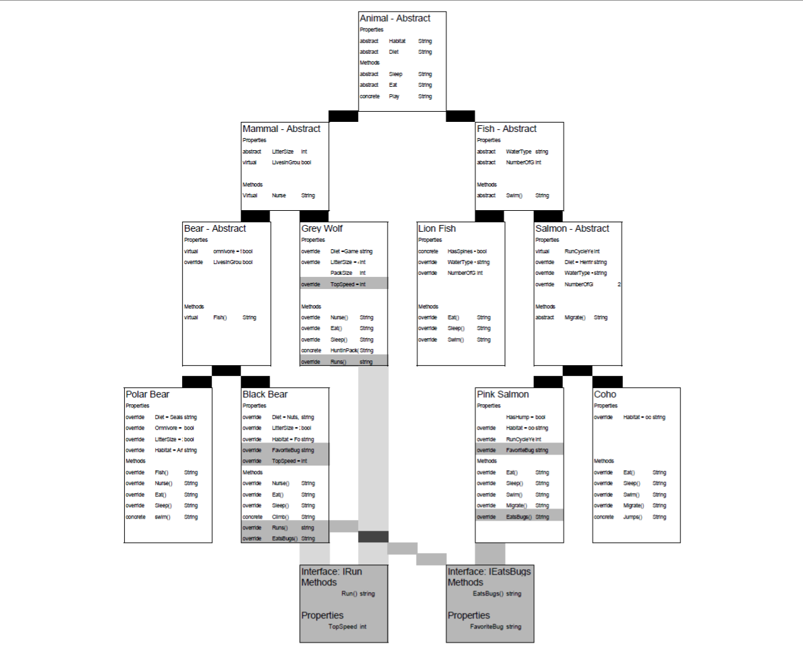

# Zoo

## Description - Classes
My Zoo contains animals. Of those animasl, there are mammals and fish.
Of the fish, there are salmon, and Lion Fish (a concrete animal)
Of Salmon, there are Coho and Pink Salmon (concrete animals)
Of Mammals there are bears, and Grey Wolves (a concrete animal)
Of Bears, there are Polar Bears and Black Bears (concrete animals)

All Animals Eat, Sleep, and Play, and have properties of Diet and Habitat.
All Fish Swim, and have properties of Number of Gils and Water Type.
All Salmon Migrate, and have properties of Run Cycle Years.
All Mammals Nurse, and have properties Litter Size and Lives In Groups
All Bears Climb, and have the property Omnivore.

## Description - Interface
Some animals in the zoo can Run (IRun) and some animals in the zoo eat bugs (IEatsBugs)
Not all the animals in the zoo run or eat bugs, but some do.
Instead of using a class and inheritance, we use Interface to give the animals the ability to Run and Eat Bugs

Not all bears eat bugs. BlackBears eat bugs, PolarBears do not.
Not all fish eat bugs, but PinkSalmon do. Sharks do not.

Instead of creating an EatsBugs method for each animal that DOES eat bugs, we create an interface, IEatsBugs.
In each class of animal that eats bugs (BlackBears, PinkSalmon) we implament the interface (IEatsBugs) to require that BlackBears and PinkSalmon have a favorite type of bugs, and the ability to eat bugs. (favoriteTypeOfBug, EatsBugs();)

## Diagram
<!-- insert here when done -->

[Google SpreadSheet Diagram](https://docs.google.com/spreadsheets/d/10-pqe4XVpvhgUE-1UbOdLMDsc0puxpsePJRI5Jf_iL0/edit?usp=sharing)

## OOP Definitons

### Class Inheritence
Inheritance dictates that a class inherits ALL of the properties and methods from it's base class.

### Abstraction
If a class will never be instantiated; if a class has derived classes so it will never be created, it should be made abstract to keep it from being instantiated.

### Encapsulation
Encapsulation is the property that holds everything within a class.

### Polymorphism
Polymorphism means that at run time, a derived class can be instatiated by it's base class. If a method takes in the base class as a parameter, it will accept the derivded class as well.

## Interface Definitions

An interface holds properties and methods that a class or object can implament. If the interface is implamented in a class, that class MUST have the methods and properties that have been defined in that interface.
Interfaces are a way that C# works around not having multi-inheritance for classes.
